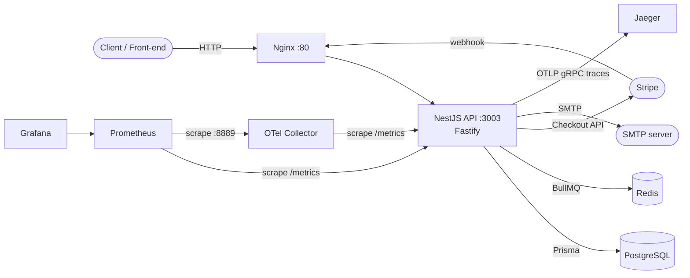
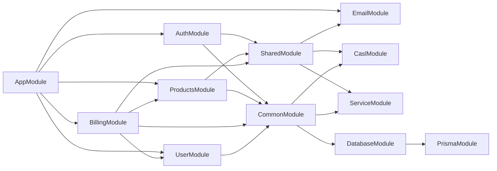
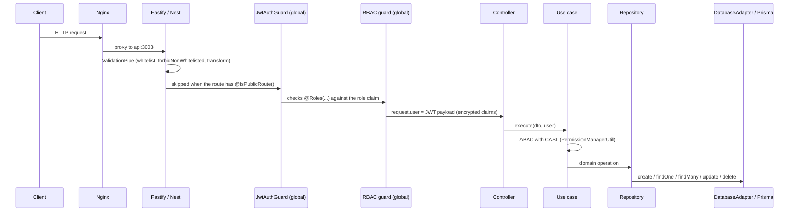

# Architecture

## Design principles

- **Clean Code:** code that is clear, concise and easy to maintain, so changes in one place do not ripple through the system.
- **Clean Architecture:** business rules are decoupled from implementation details (database, payment provider, SMTP), so those details can be replaced without touching the core.
- **SOLID:** small components with a single responsibility that depend on abstractions. Dependency inversion is what lets the project swap services through dependency injection.
- **DDD:** each business area is a bounded context (a NestJS module) that can evolve independently.

## System overview



Every container runs on the same Docker network. Only Nginx, Postgres, Jaeger UI and Grafana are published to the host.

## Folder structure

```text
src/
├── main.ts                 # bootstrap: tracing, Fastify, validation, CORS, Swagger, views
├── app.module.ts           # root module: config, queues, cache, metrics, feature modules
├── app.controller.ts       # landing page, sample protected routes, /metrics
├── config/                 # bootstrap helpers and observability config files
├── common/                 # cross-cutting infrastructure
│   ├── casl/               # CASL ability factory (ABAC)
│   ├── decorators/         # @IsPublicRoute, @Roles, @CurrentUser
│   ├── guards/             # RBAC guard (global)
│   └── modules/
│       ├── databases/      # IDatabaseAdapter + Prisma implementation
│       └── services/       # EnvService (typed access to env vars)
├── shared/                 # code shared by the feature modules
│   ├── entities/ enum/ interfaces/
│   ├── utils/              # crypto, hash, number code generator, permission manager
│   └── modules/email/      # e-mail module (queue, consumer, templates)
└── modules/                # bounded contexts
    ├── auth/
    ├── billing/
    ├── products/
    └── user/
```

## Module layers

Every feature module follows the same layout:

| Layer | Folder | Contains | May depend on |
| --- | --- | --- | --- |
| Domain | `domain/` | entities, interfaces of repositories, services, use cases and gateways | nothing |
| Application | `application/` | DTOs, enums, use cases, orchestrators | domain |
| Infrastructure | `infrastructure/` | repositories, services, gateways, strategies, jobs | domain, application |
| Interface | `interface/` | controllers, guards | application (through interfaces) |
| Module helpers | `shared/helpers/` | helpers used by several use cases of the module | domain |

The module file (`<name>.module.ts`) wires the implementations to the interfaces.



## Dependency injection convention

Each implementation is registered twice: as a class, and under a string token named after its interface. Consumers inject the token and type the property with the interface, so they never depend on the concrete class.

```ts
// products.module.ts
providers: [
  SingleProductsRepository,
  {
    provide: 'ISingleProductsRepository',
    useExisting: SingleProductsRepository,
  },
],
exports: ['ISingleProductsRepository'],

// create_single_product.use_case.ts
@Inject('ISingleProductsRepository')
private readonly _singleProductsRepository: ISingleProductsRepository;
```

To replace an implementation (another ORM, another payment provider, another mail service), write a new class that implements the interface and point the token to it.

## Naming conventions

| Item | Convention | Example |
| --- | --- | --- |
| Files | `snake_case` + role suffix | `sign_in_default.use_case.ts`, `auth.repository.ts`, `email.dto.ts` |
| Interfaces | `I` prefix, same file name + `.interface.ts` | `IAuthRepository` in `auth.repository.interface.ts` |
| DI tokens | the interface name as a string | `'IAuthRepository'` |
| Injected properties | `private readonly _camelCase` | `_authRepository` |
| Use cases and services | one public `execute()`; private steps such as `intermediary()` | `SignUpDefaultUseCase.execute()` |
| Database tables / Prisma models | `snake_case` | `user_single_purchase` |
| Routes | `kebab-case` | `/auth/sign-in-magic-link` |

The code, comments and identifiers are written in English.

## Request lifecycle



- **Authentication:** `JwtAuthGuard` is registered as a global guard in `AuthModule`. Every route requires a bearer token unless it is decorated with `@IsPublicRoute()`.
- **RBAC:** `RoleBasedAccessControlGuard` is a global guard in `CommonModule`. Routes decorated with `@Roles(RolesEnum.ADMIN)` only accept users with that role.
- **ABAC:** use cases call `IPermissionManagerUtil.validateFieldPermissions(role, input, action, entity)`, which uses the CASL abilities in `src/common/casl/casl_ability.factory.ts`. Today only `ADMIN` has abilities (`manage` on `Products`).
- **Validation:** the global `ValidationPipe` rejects unknown fields (`forbidNonWhitelisted`) and converts types (`transform`).

## Encrypted JWT claims

The JWT payload (`sub`, `email`, `role`, `name` and `type`) is encrypted with AES-256-CTR (key derived from `ENCRYPT_PASSWORD` and `ENCRYPT_SALT`) and base64 encoded before signing, so the token content cannot be read by the client. The side effect is that `@CurrentUser()` returns **encrypted** values. Decrypt them before use:

```ts
const role = (
  await this._cryptoUtil.decryptData(Buffer.from(user.role, 'base64'))
).toString();
```

`sub` is the user's `public_id` (UUID), never the numeric `id`.

## Database access

Repositories do not use Prisma directly. They use `IDatabaseAdapter` (`src/common/modules/databases`), a small generic API (`create`, `findOne`, `findMany`, `update`, `delete`) that receives the model name from `TablesEnum`. The Prisma implementation is `DatabaseAdapter`, which calls `PrismaService[model]`.

Current limitations: there is no transaction support, and the `total` returned by `findMany` ignores the `where` filter. See [Database](database.md).

## Asynchronous work

- **Queues:** BullMQ on Redis. E-mails are added to `SEND_EMAIL_QUEUE` and consumed by `SendEmailConsumerJob` in the same process. See [Email](modules/email.md).
- **Events:** `@nestjs/event-emitter` is available. Billing emits `checkout.session.completed.send.email`, but nothing listens to it yet.
- **Cache:** `@nestjs/cache-manager` with the default in-memory store. It is used to speed up verification codes and OTPs, and it is **not shared** between API instances.

## Adding a new module

1. Create `src/modules/<name>/` with the `domain`, `application`, `infrastructure` and `interface` folders.
2. Write the entity and the interfaces in `domain/`.
3. Implement the use cases in `application/use_cases/`, one class per use case with a public `execute()`.
4. Implement repositories in `infrastructure/repositories/` on top of `IDatabaseAdapter`. Add the table to `prisma/schema.prisma`, create a migration and register the model name in `TablesEnum`.
5. Expose the use cases in a controller in `interface/controllers/`. Mark public routes with `@IsPublicRoute()` and restricted ones with `@Roles(...)`. Add `@ApiTags()` and register the tag in `swagger.config.ts`.
6. Register every provider with its string token in `<name>.module.ts` and import the module in `AppModule`.
7. If the module has permissions, add the entity to `CaslEntities`/`CaslSubjectType` and the rules to `CaslAbilityFactory`.
8. Add e2e tests (see [Testing](testing.md)) and document the module in `docs/modules/`.
