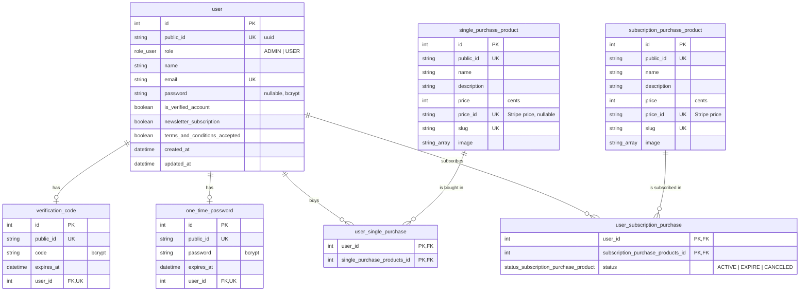

# Database

The project uses PostgreSQL 16 through Prisma 6. The schema is in `prisma/schema.prisma` and the migrations are in `prisma/migrations/`.

## Data model



| Table | Purpose |
| --- | --- |
| `user` | Accounts. `password` is null for password-less accounts. |
| `verification_code` | Account verification code (one per user, valid for 24 h). |
| `one_time_password` | Sign-in OTP (one per user, valid for 10 min). |
| `single_purchase_product` | Catalog of one-time purchase products. |
| `subscription_purchase_product` | Catalog of subscription products. |
| `user_single_purchase` | Which user bought which single product. |
| `user_subscription_purchase` | Which user subscribed to which product, and the subscription status. |

Conventions:

- every entity has an internal numeric `id` and a public `public_id` (UUID). Only `public_id` leaves the API;
- `created_at` and `updated_at` are managed by Prisma;
- prices are stored in cents; the amount actually charged is defined by the Stripe price (`price_id`);
- all relations use `onDelete: Cascade`. Deleting a product also deletes its purchase records.

## Migrations

| Environment | What runs on container start |
| --- | --- |
| Development / test | `prisma migrate dev`: applies pending migrations and regenerates the client |
| Production | `prisma migrate deploy`: applies pending migrations only |

To change the schema:

1. edit `prisma/schema.prisma`;
2. create the migration inside the development container (the `prisma` folder is mounted, so the files are written to your machine):

   ```bash
   docker exec -it api-dev pnpm exec prisma migrate dev --name <describe_the_change>
   ```

3. commit `schema.prisma` and the new folder in `prisma/migrations/`.

Rules:

- always pass `--name` (the migration `20250601194410_` was created without one);
- never edit a migration that has already been merged; create a new one;
- always call the local CLI (`pnpm exec prisma ...`). `npx prisma` may download a newer, incompatible Prisma version.

## Seed

`prisma/seed.ts` creates the users the e2e tests rely on. All of them use the password `Password123!`.

| E-mail | Role | Verified | Notes |
| --- | --- | --- | --- |
| `testadmin@exemple.com` | `ADMIN` | yes | Use it to manage products. |
| `codeexpired@exemple.com` | `USER` | yes | Has an expired verification code (`123456`). |
| `notverify@exemple.com` | `USER` | no | Account not verified. |

```bash
docker exec api-dev pnpm run seed
```

The seed is not idempotent: running it twice fails because the e-mails already exist. To start over, reset the database (this drops all data, reapplies the migrations and runs the seed):

```bash
docker exec api-dev pnpm exec prisma migrate reset --force
```

## Connecting from your machine

Postgres is published on `localhost:<MAPPED_PORT_DB>`. Use `POSTGRES_USER`, `POSTGRES_PASSWORD` and `POSTGRES_DB`, and remember that the tables live in the schema set in `DATABASE_URL` (`my_schema` in the template), not in `public`.

## Accessing data in the code

Repositories use the generic `IDatabaseAdapter` instead of Prisma directly:

```ts
@Inject('IDatabaseAdapter')
private readonly _databaseAdapter: IDatabaseAdapter;

private readonly _model = TablesEnum.USER;

const user = await this._databaseAdapter.findOne<User>(
  this._model,
  { email },
  { password: true }, // fields to omit
);
```

When you add a model, add its name to `TablesEnum` (`src/shared/enum/tables.enum.ts`). Relation field names in `create`/`update` payloads must match the names in `schema.prisma` (for example `user`, not `User`).
