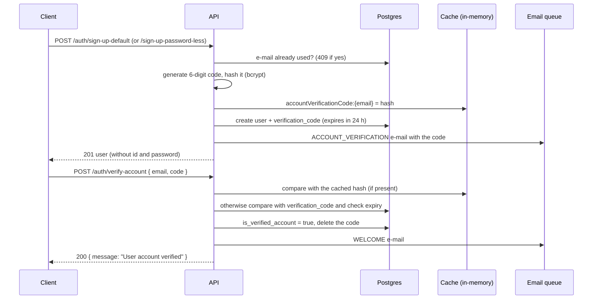

# Auth module

`src/modules/auth` handles sign-up, account verification, sign-in (password, magic link and one-time password), token refresh and password recovery. All its routes are public (`@IsPublicRoute()`).

## Flows

### Sign-up and account verification

`sign-up-password-less` creates the user without a password. That user signs in with the magic link or with an OTP.

### Sign-in with e-mail and password

`POST /auth/sign-in-default` uses the Passport `local` strategy (`LocalAuthGuard`). `ValidateUserService` checks the bcrypt hash, and the account must be verified. The response is a token pair.

### Sign-in with magic link

`POST /auth/sign-in-magic-link` generates a token pair and e-mails a link containing both tokens (`MAGIC_LINK_LOGIN` template). The front-end is expected to read the tokens from the link. The link base is hard-coded as `http://example.com/recovery-password`.

### Sign-in with one-time password

1. `POST /auth/send-one-time-password` generates a 6-digit OTP valid for 10 minutes, stores its hash in `one_time_password` and in the cache, and e-mails it (`ONE_TIME_PASSWORD` template).
2. `POST /auth/sign-in-one-time-password` with `{ email, password: "<otp>" }` validates the OTP and returns a token pair.

### Refresh

`POST /auth/refresh-token` verifies the refresh token (signature, expiry and `type` claim) and returns a new pair. Refresh tokens are not rotated or revoked: an old refresh token stays valid until it expires.

### Password recovery

1. `POST /auth/forgot-password` e-mails a link with a recovery token (`PASSWORD_RECOVERY` template). The link base is hard-coded as `http://example.com/recovery-password?token=...`.
2. `POST /auth/recovery-password?token=<token>` with `{ password }` sets the new password.

## Tokens

| Token | Secret | Lifetime | `type` claim |
| --- | --- | --- | --- |
| Access | `SECRET_ACCESS_TOKEN_KEY` | 30 min | `access_token` |
| Refresh | `SECRET_REFRESH_TOKEN_KEY` | 7 days | `refresh_token` |
| Recovery | `SECRET_RECOVERY_PASSWORD_TOKEN_KEY` | 30 min | `recovery_password_token` |

All claims (`sub`, `email`, `role`, `name`, `type`) are encrypted before signing. See [Architecture](../architecture.md#encrypted-jwt-claims). `JwtStrategy` only accepts tokens whose `type` is `access_token`, so a refresh token cannot be used to call protected routes.

## Main classes

| Class | Responsibility |
| --- | --- |
| `AuthController` | HTTP routes. |
| `SignUpDefaultUseCase`, `SignUpPasswordLessUseCase` | Create the account and send the verification code. |
| `VerifyAccountUseCase` | Validate the code and mark the account as verified. |
| `SignInDefaultUseCase` + `LocalStrategy` + `ValidateUserService` | Password sign-in. |
| `SignInMagicLinkUseCase` | Magic link sign-in. |
| `SendOneTimePasswordService`, `SignInOneTimePasswordUseCase` | OTP sign-in. |
| `RefreshTokenService` | Refresh the token pair. |
| `ForgotPasswordService`, `RecoveryPasswordUseCase` | Password recovery. |
| `GenerateTokenHelper` | Encrypt the claims and sign the tokens. |
| `JwtStrategy`, `JwtAuthGuard` | Authenticate protected routes (global guard). |
| `AuthRepository`, `VerificationCodesRepository`, `OneTimePasswordRepository` | Persistence. |

## Known limitations

These are confirmed problems. They are also listed in [Project status](../project-status.md).

- **Password recovery with distinct secrets fails with `500`.** The recovery token is signed with `SECRET_RECOVERY_PASSWORD_TOKEN_KEY` (`generate_token.helper.ts`) but verified with `SECRET_REFRESH_TOKEN_KEY` (`recovery_password.use_case.ts`). It only works when both secrets are equal, which is the case in `.env.example`.
- **Invalid or expired tokens return `500`** instead of `401` in `/auth/refresh-token` and `/auth/recovery-password`. The e2e tests document this behavior.
- **Missing checks return `500`:** verifying an account that has no pending code (for example, already verified) and signing in with an OTP that was never requested.
- **Requesting a second OTP before using the first fails,** because `one_time_password.user_id` is unique and the service always inserts a new row.
- **An OTP can be used twice:** when it is validated from the cache, the database copy is not deleted and remains valid until it expires.
- **Cache TTLs are in milliseconds.** `cache-manager` v6 expects milliseconds, so the values written as "5 hours" (`18_000`) and "24 hours" (`86400`) last 18 and 86 seconds. The flows still work because they fall back to the database.
- **E-mail links point to `http://example.com`** and the e-mails are always in Portuguese (`pt_br`).
- **`/auth/sign-in-one-time-password` uses `SignInDefaultDto`** (string password with at least 6 characters) instead of `SignInOneTimePasswordDto`, so Swagger shows the wrong schema.
- **No logout, token revocation or rate limiting.** Brute force on passwords, codes and OTPs is not limited.
- **User enumeration:** `forgot-password` answers `404` for unknown e-mails and `sign-up` answers `409` for known ones.
