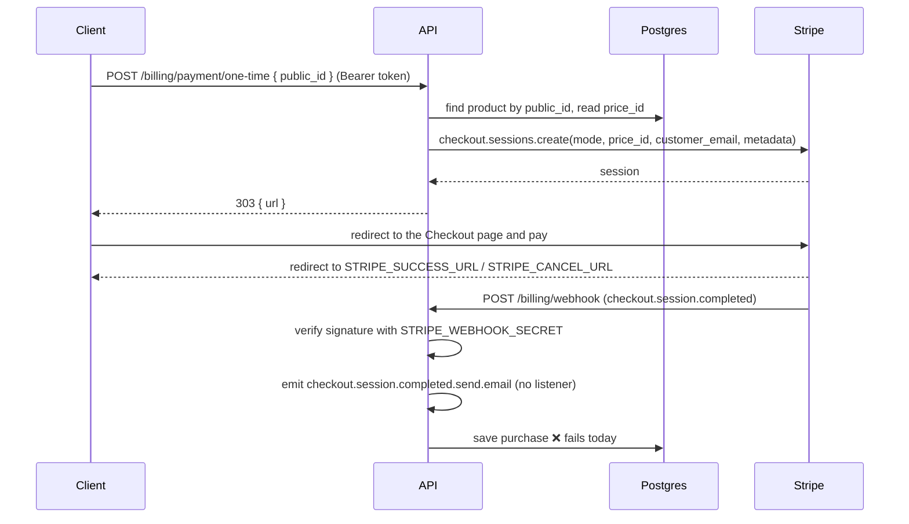

# Billing module

`src/modules/billing` integrates the catalog with Stripe Checkout, for one-time purchases and subscriptions.

> **Status: partially implemented.** Creating a checkout session and receiving the Stripe webhook work. Recording the purchase after payment **does not** work yet, and the subscription lifecycle, confirmation e-mails and purchase queries are not implemented. See [What is missing](#what-is-missing).

## Payment flow



1. **Checkout.** `OneTimePaymentUseCase` or `SubscriptionPaymentUseCase` decrypts the user from the token, finds the product and asks the gateway for a Checkout Session. The session is created with:
   - `mode: payment` (one-time) or `mode: subscription`;
   - `line_items: [{ price: <product price_id>, quantity: 1 }]`;
   - `customer_email`: the user's e-mail;
   - `metadata: { customerId: <user public_id>, customerEmail, productId: <product public_id> }`;
   - `success_url` and `cancel_url` from the environment.

   The route answers with status `303` and the session URL in the body (there is no `Location` header). The front-end must redirect the user to `url`.
2. **Webhook.** `POST /billing/webhook` is public. It reads the raw body (`rawBody: true` in `main.ts`) and the `stripe-signature` header, and `StripeGateway.handleWebhookEvent` validates the event with `stripe.webhooks.constructEvent`.
3. **Fulfillment.** For `checkout.session.completed`, the gateway emits an internal event and calls `PurchasesOrchestrators.savePurchaseProductToUser(paymentType, customerId, productId)`, which delegates to `SinglePurchasesService` or `SubscriptionPurchasesService`. Every other event is only logged with `console.log`.

## Main classes

| Class | Responsibility |
| --- | --- |
| `BillingController` | Routes. |
| `OneTimePaymentUseCase`, `SubscriptionPaymentUseCase` | Start a checkout. |
| `IPaymentGatewayAdapter` / `PaymentGatewayAdapter` | Abstraction over the payment provider. |
| `StripeGateway` | Stripe client: checkout sessions and webhook handling. |
| `WebhookService` | Passes the webhook to the gateway. |
| `PurchasesOrchestrators` | Chooses the single or subscription purchase service. |
| `SinglePurchasesService`, `SubscriptionPurchasesService` | Resolve user and product ids and save the purchase. |
| `SinglePurchasesRepository`, `SubscriptionPurchasesRepository` | Persist `user_single_purchase` / `user_subscription_purchase`. |

## Trying it locally

1. Set `STRIPE_SECRET_KEY` (test mode), `STRIPE_SUCCESS_URL` and `STRIPE_CANCEL_URL` in `.env`.
2. Forward the webhooks with the Stripe CLI and put the printed secret in `STRIPE_WEBHOOK_SECRET`:

   ```bash
   stripe listen --forward-to http://localhost:<MAPPED_PORT_NGINX>/billing/webhook
   ```

3. Restart the API, create a product with a real test `price_id` (see [Products](products.md#creating-a-sellable-product)) and sign in as a verified user.
4. Start a checkout and open the returned URL:

   ```bash
   curl -X POST "http://localhost:<MAPPED_PORT_NGINX>/billing/payment/one-time" \
     -H "Authorization: Bearer <access_token>" \
     -H "Content-Type: application/json" \
     -d '{"public_id":"<product public_id>"}'
   ```

5. Pay with the test card `4242 4242 4242 4242` and watch `docker logs -f api-dev`.

## What is missing

| Item | State | Details |
| --- | --- | --- |
| Checkout session (one-time and subscription) | ✅ done | |
| Webhook signature verification | ✅ done | |
| Save the purchase after `checkout.session.completed` | ❌ broken | The repositories send `User`, `SinglePurchaseProducts` and `SubscriptionPurchaseProducts` as relation names, but the Prisma relations are `user`, `single_purchase_product` and `subscription_purchase_product`. For subscriptions, `status` is also sent inside `connect` instead of on the purchase row. Prisma rejects both payloads with `PrismaClientValidationError`, so the webhook answers `500` and nothing is saved. |
| Payment confirmation e-mail | ❌ missing | `checkout.session.completed.send.email` is emitted, but there is no `@OnEvent` listener. The `PAYMENT_SUCCEEDED` template exists and is not used. |
| Subscription lifecycle | ❌ missing | `customer.subscription.updated/deleted`, `invoice.paid` and `invoice.payment_failed` are only logged. The `EXPIRE` and `CANCELED` statuses are never set, and the Stripe subscription id is not stored, so a subscription cannot be matched to its row. |
| Stripe customer | ❌ missing | No `stripe_customer_id` is stored on the user. Each checkout passes only `customer_email`. |
| Idempotency | ❌ missing | Processed event ids are not stored. A retried `checkout.session.completed` would try to insert the same purchase again (composite primary key conflict). |
| Payment history | ❌ missing | There is no table with amount, currency, status, session or invoice ids. The purchase tables only link users and products. |
| Purchase and subscription queries | ❌ missing | No routes to list "my purchases", check a subscription or cancel it, and no Stripe Customer Portal. |
| Entitlements | ❌ missing | No guard or service checks whether a user has bought a product or has an active subscription. |
| Refunds and disputes | ❌ missing | `charge.refunded` and `charge.dispute.*` are not handled. |
| Catalog sync with Stripe | ❌ missing | See [Products](products.md#known-limitations). |
| Tests | ❌ missing | `test/cases/billing/*.e2e-spec.ts` are placeholders (`webhook.e2e-spec.ts` is empty) and are not imported in `test/index.e2e-spec.ts`. |
| Error handling | ⚠️ | A product that does not exist returns `500` (null access). An invalid webhook signature returns `500` instead of `400`. |
| Provider independence | ⚠️ | `PaymentGatewayAdapter` injects `StripeGateway` directly, and the fulfillment logic lives inside the Stripe gateway. A second provider would need to duplicate it. |

## Suggested plan to finish the flow

Each step can be a separate pull request:

1. **Fix persistence:** use the relation names from `schema.prisma` in both repositories and put `status` on the subscription purchase row. Add e2e tests that post a signed `checkout.session.completed` event (build it with `stripe.webhooks.generateTestHeaderString`) and assert the purchase row.
2. **Move fulfillment out of the gateway:** make the gateway only parse and verify events, returning a provider-agnostic event, and let a billing service decide what to do. Return `400` for invalid signatures.
3. **Idempotency:** store processed Stripe event ids (unique) and skip duplicates. Treat an existing purchase as success.
4. **Payment records:** add a table for payments (user, product, amount, currency, status, Stripe session/payment intent/invoice ids) and a `stripe_customer_id` on the user. Reuse the customer on the next checkouts.
5. **Subscription lifecycle:** store the Stripe subscription id and handle `customer.subscription.updated`, `customer.subscription.deleted` and `invoice.payment_failed` to keep the status in sync.
6. **E-mail:** add an `@OnEvent('checkout.session.completed.send.email')` listener that queues the `PAYMENT_SUCCEEDED` template.
7. **User-facing routes:** list purchases and subscriptions, cancel a subscription, open the Stripe Customer Portal.
8. **Entitlements:** a guard or decorator such as `@RequiresSubscription(productId)` for SaaS features.
