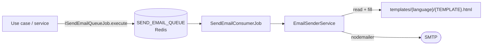

# Email module

`src/shared/modules/email` sends transactional e-mails in the background through a BullMQ queue on Redis.

## How it works



1. A use case calls `ISendEmailQueueJob.execute(dto)` with an `EmailSenderDto` (`emailTo`, `subject`, `language`, `template`, `variables`). The call returns as soon as the job is queued.
2. `SendEmailConsumerJob` (a BullMQ worker in the same process) consumes the job.
3. `EmailSenderService` reads `src/shared/modules/email/infrastructure/templates/<language>/<template>`, replaces the placeholders and sends the message with nodemailer, using the `EMAIL_*` variables.

## Templates

Placeholders use the `%{{NAME}}%` syntax and are replaced by the keys of `variables`.

| Template (`TemplateEnum`) | Variables | Sent by |
| --- | --- | --- |
| `ACCOUNT_VERIFICATION` | `NAME`, `CODE` | sign-up (default and password-less) |
| `WELCOME` | `NAME`, `LINK` | account verification |
| `MAGIC_LINK_LOGIN` | `NAME`, `LINK` | magic link sign-in |
| `ONE_TIME_PASSWORD` | `NAME`, `OTP` | OTP request |
| `PASSWORD_RECOVERY` | `NAME`, `LINK` | forgot password |
| `PAYMENT_SUCCEEDED` | `NAME`, `PRODUCT_NAME`, `VALUE`, `PAYMENT_TYPE`, `PAYMENT_METHOD`, `DATE`, `LINK` | not used yet (see [Billing](billing.md#what-is-missing)) |

Only the `pt_br` language exists (`LanguageEnum.PT_BR`).

### Adding a template

1. Create `src/shared/modules/email/infrastructure/templates/pt_br/<NAME>.html` with `%{{VARIABLE}}%` placeholders. The existing templates are a good starting point for the layout.
2. Add `<NAME> = '<NAME>.html'` to `TemplateEnum` (`application/enum/template.enum.ts`).
3. Queue it:

   ```ts
   await this._sendEmailQueueJob.execute({
     emailTo: user.email,
     language: LanguageEnum.PT_BR,
     subject: 'Subject',
     template: TemplateEnum.<NAME>,
     variables: { NAME: user.name },
   });
   ```

### Adding a language

Add a value to `LanguageEnum` (`src/shared/enum/language.enum.ts`) and a folder with the same name under `templates/` containing every template. The callers still send `LanguageEnum.PT_BR` today, so they must be changed to pass the user's language.

## Testing endpoint

`POST /email/email-sender` queues any template for any address. It is **public**, which turns the API into an open relay for your SMTP account. Protect it with `@Roles(RolesEnum.ADMIN)` or remove it before deploying.

## Troubleshooting

Failed jobs are not logged. To see why a message was not sent, read the job from Redis:

```bash
docker exec redis-dev redis-cli --scan --pattern 'bull:SEND_EMAIL_QUEUE:[0-9]*'
docker exec redis-dev redis-cli hget bull:SEND_EMAIL_QUEUE:<id> failedReason
```

## Known limitations

- **E-mails fail in the production image.** `Dockerfile.prod` deletes `src/`, and the templates are read from `src/shared/modules/email/infrastructure/templates` at runtime, so every job fails with `ENOENT`. The templates must be copied to `dist` (for example with the `assets` option of `nest-cli.json`) and read from there.
- Failed jobs are not retried (BullMQ default of one attempt) and not logged.
- The sender name is hard-coded as `Seu Nome`.
- The links in the templates' variables are hard-coded to `example.com`.
